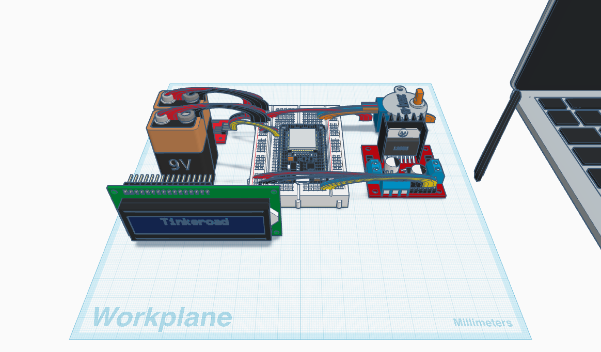
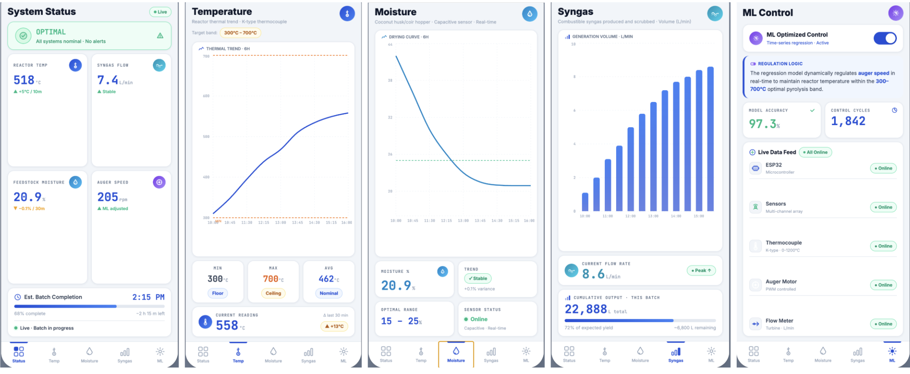

# Concentrated Solar Pyrolysis & ML Auger Control System

> **JA WE Challenge Philippines 2026 Submission**  
> *Concentrated Solar Pyrolysis and Syngas Reforming Engine with Machine Learning Auger Control for Bicol Coconut Husk and Coir Dust Residues*

---

## 📌 Executive Summary
This repository houses the technical architecture, mechanical CAD models, and companion mobile application designs for an automated solar-thermal waste-to-energy unit. By combining concentrated solar-thermal collectors with an ESP32 edge microcontroller and a time-series regression model running on a companion Android app, the system dynamically regulates biomass auger feed rates to maintain the pyrolysis reactor within its optimal thermal band (300°C–700°C) under variable solar irradiance.

---

## 🔗 Interactive Deliverables & Links

| Deliverable | Format | Access Link | Description |
| :--- | :--- | :--- | :--- |
| **Android App Prototype** | Figma | [Launch Interactive Figma Prototype](https://www.figma.com/make/6u3JdHBM3GXaNequFB2ogl/Industrial-IoT-Mobile-Dashboard?fullscreen=1&t=DYqQNa4T4kU2sYYH-1&code-node-id=0-6) | Non-scrollable 5-screen Android UI prototype demonstrating real-time telemetry. |
| **3D CAD Enclosure Model** | Tinkercad | Included in Repository | High-precision 3D mechanical model of the ESP32 control box and sensor ports (See Hardware section below). |

---

## ⚙️ System Architecture & Process Flow

[ Raw Coconut Husk / Coir Dust ]
               │
               ▼
┌──────────────────────────────┐       ┌──────────────────────────────┐
│  Capacitive Moisture Sensor  │───────►│    ESP32 Microcontroller     │
└──────────────────────────────┘       │  (Telemetry & Pulse Driver)  │
                                       └──────────────┬───────────────┘
                                                      │
[ Solar Collector / Thermal ]                         │ BLE / Wi-Fi Streaming
               │                                      ▼
               ▼                       ┌──────────────────────────────┐
┌──────────────────────────────┐       │   Android Companion App      │
│ Stainless Steel Reactor Tube │       │   (Runs Time-Series ML Model)│
│       (300°C – 700°C)        │       └──────────────┬───────────────┘
└──────────────┬───────────────┘                      │
               │                                      │ (Target RPM Command)
               ▼                                      ▼
┌──────────────────────────────┐       ┌──────────────────────────────┐
│ K-Type Thermocouple +        │───────►│ NEMA 17 Stepper & Auger Feed │
│ MAX6675 Cold-Junction Module │       │  (Adjusts Biomass Volume)    │
└──────────────────────────────┘       └──────────────────────────────┘
               │
               ▼
[ Clean Syngas / Biochar Output ]

---

## 🧠 Machine Learning Control Logic
The dynamic feed adjustment relies on a real-time time-series regression model running on the companion app. The control function computes the required auger speed as a function of instantaneous reactor temperature, thermal derivative, and feedstock moisture content.

* **Target Operating Band:** 300°C to 700°C
* **Under-temperature Response (< 300°C):** Automatically throttles auger speed to reduce thermal mass load and allow reactor recovery.
* **Over-temperature Response (> 700°C):** Accelerates feedstock injection to absorb excess solar thermal energy and stabilize reactor temperature.

---

## 🛠️ Mechanical & Enclosure CAD Models
The control box housing the ESP32, A4988 driver, power regulation modules, and external sensor terminal blocks was modeled in 3D using Tinkercad.

### Isometric Assembled View

### Exploded Assembly View

---

## 📱 Companion Mobile Application Interface (Figma UI)
The companion mobile dashboard was prototyped in Figma as a non-scrollable 5-screen Android application following Material Design 3 guidelines.

### Screen Breakdown
1. **System Status:** 2x2 Metric Grid and Batch Completion progress bar.
2. **Temperature Dynamics:** Thermal trend line chart against target pyrolysis bounds.
3. **Moisture Analysis:** Capacitance feedback graph and optimal range targets.
4. **Syngas Yield:** Vertical bar chart measuring volume production (L/min).
5. **ML Control Hub:** Master toggle for dynamic regression control and live node diagnostics.

---

## 📂 Repository File Manifest

* `README.md` - Primary repository overview and technical documentation
* `control_box_isometric.png` - Tinkercad 3D render (Isometric view)
* `control_box_exploded.png` - Tinkercad 3D render (Exploded assembly)
* `figma_dashboard.png` - Figma mobile UI multi-screen preview

*(Note: The full Innovation Proposal and Pitch Deck PDFs are submitted directly to the judging committee via email per competition guidelines).*

---

## 👥 Project Team & Acknowledgments

* **Proponents:** Kaiser Francis L. Badiong & Marqus Szymon E. Pelagio
* **Research Coach:** Engr. John Roy Galvez, CCPE, CRS
* **Institution:** Camarines Sur National High School (Special Program in Science, Technology, and Engineering)
* **Organizers:** Junior Achievement Philippines & Aramco
